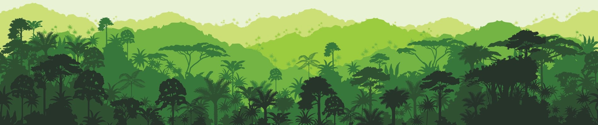

# Kaggle Quest

This repository contains the source code that I have written for Kaggle competitions.

My Kaggle Profile can be found [here](https://www.kaggle.com/andersy005).

## 1. [Planet: Understanding the Amazon from Space](): Use satellite data to track the human footprint in the Amazon rainforest

